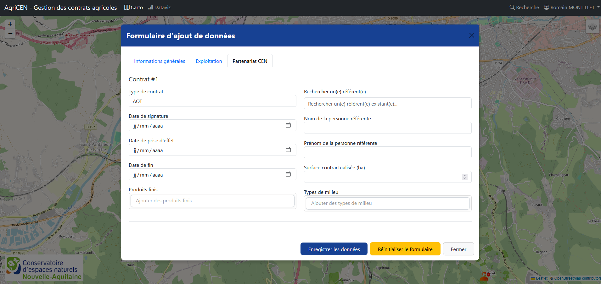

# Gestion des contrats

## Création d'un nouveau contrat

Pour créer un nouveau contrat, suivez ces étapes :

1. Depuis l'interface cartographique, cliquez sur le site CEN concerné
2. Vous arriverez sur un formulaire de saisie avec plusieurs onglets
3. Remplissez les informations requises dans chaque onglet
4. Enregistrez le contrat avec le bouton "Enregistrer les données" en bas du formulaire

## Structure du formulaire

Le formulaire de création/édition de contrat est organisé en plusieurs sections :

### Informations générales

- **Code site** : Code du site CEN concerné
- **Nom du site** : Nom du site CEN concerné

### Exploitation

Cette section regroupe toutes les données relatives à l'exploitation :

- **N° SIRET** : Pour les sociétés, avec récupération automatique des données via l'API SIRENE
- **Nom de la Société** : nom de la société récupéré automatiquement via l'API SIRENE
- **Adresse complète de l'établissement** : adresse de l'établissement récupérée automatiquement via l'API SIRENE
- **Activité principale** : activité principale récupérée automatiquement via l'API SIRENE
- **Catégorie juridique** : catégorie juridique récupérée automatiquement via l'API SIRENE
- **Tranche d'effectif salarié de l'établissement** : tranche d'effectif récupérée automatiquement via l'API SIRENE
- **Contact** : contact (téléphone ou email)
- **Recherche d'un exploitant existant** : champ permettant de récupérer le nom et le prénom d'un exploitant existant ou de créer un nouvel exploitant
- **Nom de l'exploitant** : saisie du nom de l'exploitant si non fait via le champ "Rechercher un exploitant"
- **Prénom de l'exploitant** : saisie du prénom de l'exploitant si non fait via le champ "Rechercher un exploitant"
- **Date de naissance** : date de naissance de l'exploitant
- **Types de production Biologique** : saisie des types de production biologique
- **Types de production Conventional** : saisie des types de production conventionnel

### Partenariat CEN

Cette section regroupe les informations relatives au contrat agricole :

- **Type de contrat** : type de contrat concerné
- **Date de signature** : date de signature du contrat
- **Date de prise d'effet** : date de prise d'effet du contrat
- **Date de fin** : date de fin du contrat
- **Produits finis** : Sélection multiple possible (viande, lait, céréales, etc.)
- **Type de milieux** : Sélection multiple possible (prairie, zone humide, forêt, etc.)
- **Nom de la personne référente** : nom du salarié CEN référebt du contrat agricole concerné
- **Prénom de la personne référente** : prénom du salarié CEN référebt du contrat agricole concerné
- **Types de milieu** : Sélection multiple possible (prairie, zone humide, forêt, etc.)

## Modification d'un contrat existant

Pour modifier un contrat :

1. Depuis l'interface cartographique, cliquez sur l'icône du contrat souhaité puis cliquez sur "Modifier" en bas du volet latéral
2. Le formulaire d'édition s'ouvre avec les données existantes pré-remplies
3. Effectuez vos modifications
4. Cliquez sur "Enregistrer les données" pour enregistrer les changements

## Suppression d'un contrat

Pour supprimer un contrat :

1. Depuis l'interface cartographique, cliquez sur l'icône du contrat souhaité puis cliquez sur "Supprimer" en bas du volet latéral

!!! warning "Attention"
    La suppression d'un contrat est irréversible. 
    
## Validation des données

Le formulaire intègre plusieurs validations pour garantir la qualité des données :

- Vérification des champs obligatoires
- Validation des formats (dates, nombres)
- ...

Les erreurs sont affichées directement sous les champs concernés, avec des explications détaillées pour corriger rapidement les problèmes.
