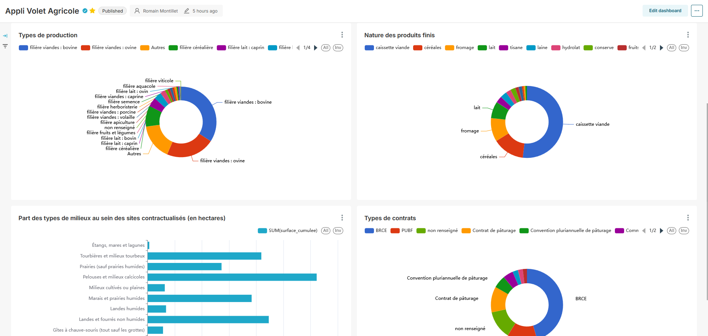

# Visualisation des données

AgriCEN propose des outils avancés de visualisation et d'analyse des données pour faciliter le suivi des contrats et l'aide à la décision.

## Tableau de bord Superset

Les visualisations sont principalement accessibles via une intégration avec Superset.

### Accès au tableau de bord

Pour accéder au tableau de bord :

1. Dans AgriCEN, cliquez sur l'onglet "Dataviz"
2. Vous serez automatiquement redirigé vers l'interface Superset préchargée
3. Pas d'authentification requise (à modifier si besoin)

## Intégration dans des rapports externes

Les visualisations peuvent être intégrées dans des documents externes :

- **URL partageables** pour accéder directement à une visualisation spécifique
- **Export au format image** (PNG, JPEG) pour intégration dans des documents
- **Export au format PDF** pour des rapports complets

## Rapports exportables

### Export PDF

Pour exporter les données au format PDF :

1. Dans la navbar principale, cliquez sur le bouton "..."
2. Cliquez ensuite sur "Download" -> "Export to PDF"

