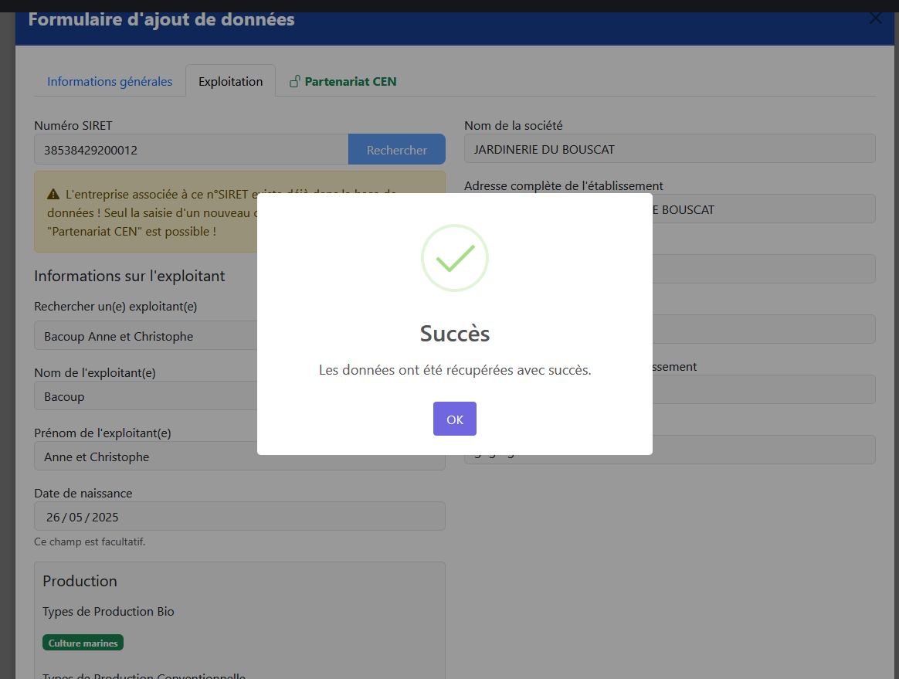

# Recherche SIRET

AgriCEN intègre une fonctionnalité permettant de rechercher et importer automatiquement les informations des entreprises à partir de leur numéro SIRET, grâce à l'API SIRENE.

## Qu'est-ce que l'API SIRENE ?

L'API SIRENE (Système Informatisé du Répertoire National des Entreprises et des Établissements) est un service proposé par l'INSEE qui permet d'accéder aux informations légales sur les entreprises et établissements français.

Cette intégration dans AgriCEN vous permet de récupérer automatiquement les informations officielles d'une entreprise sans avoir à les saisir manuellement, réduisant ainsi les erreurs de saisie.

## Utilisation de la recherche SIRET

### Lors de la création ou de l'édition d'un contrat

1. Dans le formulaire de création/modification de contrat, accédez à l'onglet "Exploitation"
2. Entrez le numéro SIRET (14 chiffres) dans le champ prévu à cet effet
3. Cliquez sur le bouton "Rechercher"
4. Si le SIRET est valide, les informations de l'entreprise seront automatiquement remplies

## Informations récupérées

La recherche SIRET permet de récupérer automatiquement les informations suivantes :

- **Nom de l'entreprise**
- **Code juridique** et libellé de la forme juridique
- **Code APE/NAF** et libellé de l'activité principale
- **Adresse** complète de l'établissement
- **Tranche d'effectif** de l'entreprise

Ces informations sont directement intégrées dans le formulaire et seront enregistrées dans la base de données lors de la sauvegarde du contrat.

## Fonctions avancées

### Vérification de contrat existant

Lorsqu'un N° SIRET est récupéré via le formulaire d'édition d'un contrat, le système vérifie automatiquement si un contrat existe déjà avec cette entreprise. Si c'est le cas :

- Une notification apparaît pour vous informer
- Un lien vers le contrat existant est proposé
- Vous pouvez choisir de continuer à créer un nouveau contrat ou d'éditer celui qui existe déjà

## Résolution des problèmes

### SIRET non trouvé

Si le SIRET n'est pas trouvé, plusieurs raisons peuvent expliquer cela :

- Erreur de saisie dans le numéro SIRET
- L'entreprise est très récente et pas encore référencée
- L'entreprise n'existe plus (radiée)
- Problème temporaire avec l'API SIRENE

### Contournement manuel

En cas de problème avec la recherche automatique, vous pouvez toujours :

1. Saisir manuellement les informations de l'entreprise
2. Utiliser le site officiel [sirene.fr](https://sirene.fr) pour vérifier les informations
3. Contacter le service DSI si le problème persiste
